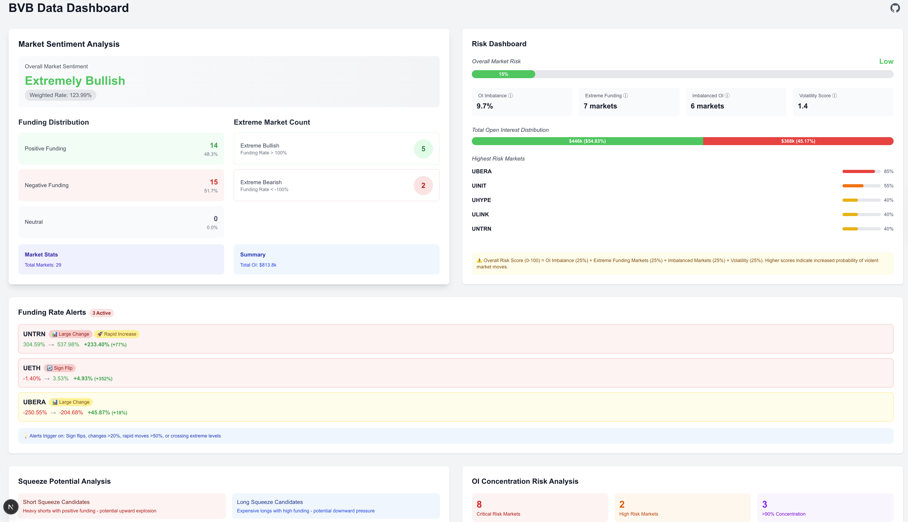
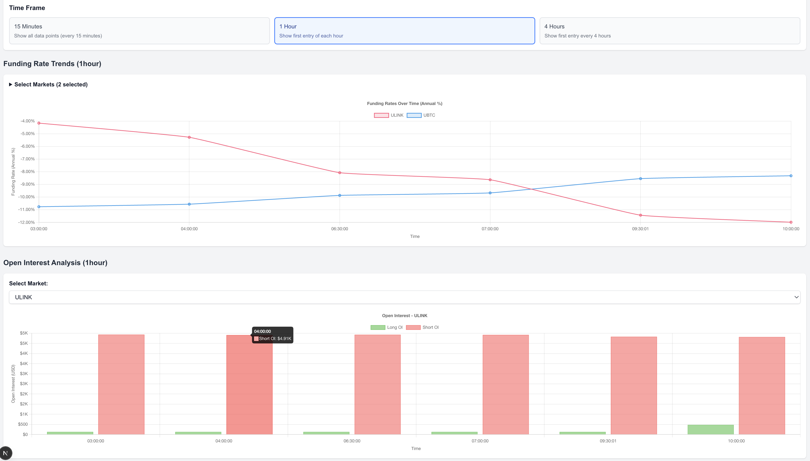

# BVB Funding Rate Dashboard

A funding rate monitoring dashboard for BVB ([Bull vs. Bear](https://bullbear.zone/)) markets on Neutron blockchain. Features automated data collection every 15 minutes, multiple timeframes, and comprehensive risk analysis. No wallet or whatsoever needed, just install and run.

> **Disclaimer**: This is a fan-made project. The author/maintainers have no affiliation with the BvB platform itself.

## Features

- 📊 **Funding Rate Tracking**: Monitor funding rates across all BVB markets (updated every 15 minutes)
- 📈 **Visualized Charts**: Dynamic funding rate and open interest visualization
- 🚨 **Risk Analysis**: Market sentiment, squeeze potential, and concentration risk metrics
- ⚡ **Automated Data Collection**: Cron job fetches data every 15 minutes

## Screenshots

### Main Dashboard Overview



_The main dashboard showing market sentiment analysis, risk dashboard, funding rate alerts, and squeeze potential analysis._

### Charts and Analysis



_Interactive funding rate trends and open interest analysis with time frame selection and detailed market data._

## Architecture

### Data Collection

- **Update Frequency**: Data fetched every 15 minutes from BVB contracts
- **Data Source**: Neutron blockchain via CosmWasm queries

### Data Storage (MongoDB)

- **Database**: `dashboard`
- **Collections**:
  - `markets`: Stores market information (denom, display name)
  - `funding_rates`: Stores funding rate snapshots with timestamps

## Getting Started

### Prerequisites

PM 2 (process manager)

```bash
npm install -g pm2  # For process management
```

MongoDB instance (local or cloud)

- Cloud (recommended): Use [MongoDB Atlas](https://www.mongodb.com/cloud/atlas) (free tier available)
- Local: Install [MongoDB Community Edition](https://www.mongodb.com/docs/manual/installation/)

- _Note that You need to manually create a database named `dashboard` and two collections named `markets` and `funding_rates`_.

### Installation

```bash
npm install
```

### Environment Setup

Create a `.env` file:

```env
# MongoDB connection string (required)
# For MongoDB Atlas:
MONGODB_URI=mongodb+srv://<username>:<password>@<domain>/?retryWrites=true&w=majority&appName=<appName>

# Neutron RPC URL (optional - will use random public RPC if not set)
NEUTRON_RPC_URL=https://rpc-lb.neutron.org
```

### Development

```bash
# Start the development server
npm run dev

# Start the cron scheduler with PM2 (production)
npm run cron:pm2
```

> **⏰ First Run Notice**: On your first run, there won't be enough historical data to display meaningful charts and analysis. Start the cron scheduler and wait a few hours to collect sufficient data points. The dashboard will show more insights as data accumulates over time.

### Production Deployment

```bash
# Build the application
npm run build

# Start the application
npm start

# Start the cron scheduler with PM2
npm run cron:pm2
```

## Available Scripts

- `npm run dev` - Start development server with Turbopack
- `npm run build` - Build for production
- `npm start` - Start production server
- `npm run cron:pm2` - Start cron scheduler with PM2
- `npm run fetch-rates` - Manually fetch funding rates

## PM2 Management

```bash
# View running processes
pm2 list

# View logs
pm2 logs funding-rate-cron

# Restart process
pm2 restart funding-rate-cron

# Stop process
pm2 stop funding-rate-cron

# Delete process
pm2 delete funding-rate-cron
```

## Project Structure

```
src/
├── app/
│   ├── components/          # React components
│   ├── dashboard/           # Main dashboard page
│   ├── utils/              # Utility functions
│   └── constant/           # Configuration constants
└── cron/                   # Automated data collection
```

## Data Flow

1. **Cron Scheduler** (`scheduler.ts`) runs every 15 minutes
2. **Data Fetcher** (`fetchFundingRates.ts`) queries BVB contracts on Neutron
3. **MongoDB Storage** persists funding rates and market data to collections
4. **Dashboard** queries MongoDB and filters data based on selected timeframe
5. **Charts** display funding rates and open interest (15-minute intervals)

## Key Components

### Risk Analysis

- **Market Sentiment**: Overall market direction analysis
- **Squeeze Potential**: Identifies potential short/long squeezes
- **Concentration Risk**: Monitors open interest distribution
- **Funding Rate Alerts**: Automated threshold monitoring
- **Funding Rate Trend**: Tracks funding rates over time
- **Open Interest Analysis**: Visualizes open interest trends

## Tech Stack

- **Frontend**: Next.js 15, React 19, TailwindCSS
- **Database**: MongoDB with native Node.js driver
- **Blockchain**: CosmJS for Neutron integration

## Disclaimer

This project is created by independent developers and is not affiliated with, endorsed by, or connected to Bull vs. Bear (BvB) platform or its operators. This is a fan-made monitoring tool for educational and informational purposes.

**Data Interpretation**: All calculations, risk metrics, and analysis presented in this dashboard reflect the author's interpretation of the raw blockchain data. These calculations are subjective and you may disagree with the methodology or conclusions. Always conduct your own research and analysis before making any trading decisions. DYOR.

## License

MIT License - see LICENSE file for details.
